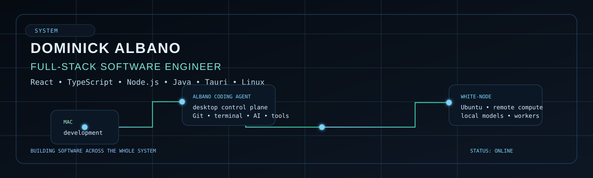

<h1 align="center">Dominick Albano</h1>

<p align="center">
  <strong>Full-Stack Software Engineer</strong><br />
  React · TypeScript · Node.js · Java · Developer Tools · Linux
</p>

<p align="center">
  <a href="https://dev-dominick.com"><b>Portfolio</b></a>
  ·
  <a href="https://www.linkedin.com/in/dominick-albano"><b>LinkedIn</b></a>
</p>

<p align="center">
  
</p>

---

I build across the browser, backend, and development environment.

At Comcast I worked on large web applications, internal tooling, shared frontend systems, APIs, and customer-facing workflows.

These days most of my side-project energy is going into developer tooling and the machines behind it.

## Current build

### Albano Coding Agent

A Tauri desktop development app built around the way I actually work: code, terminal, Git, browser tooling, AI assistance, and remote compute in one place.

```text
Mac ──► Albano Coding Agent ──► white-node
         │                         │
         └──── desktop workflow ───┘
```

The interesting part is not just the UI. It is figuring out where desktop work ends, where remote compute starts, and how to make the whole system feel like one tool.

## Public work
<table>
<tr>
<td width="50%" valign="top">

### weather-app-nextjs
Next.js + TypeScript frontend built around typed application state and responsive UI.

`Next.js` `TypeScript` `React` `Tailwind`

</td>
<td width="50%" valign="top">

### lets-go
Full-stack event app with authentication, GraphQL APIs, and MongoDB-backed data.

`React` `GraphQL` `Apollo` `MongoDB`

</td>
</tr>

<tr>
<td width="50%" valign="top">

### internet-retail-back-end
E-commerce API with relational models for products, categories, and inventory.

`Node.js` `Express` `Sequelize` `MySQL`

</td>
<td width="50%" valign="top">

### textEditor
Installable PWA with offline behavior and browser-side persistence.

`PWA` `IndexedDB` `Webpack` `Express`

</td>
</tr>
</table>

## How I got here
Before software, I was a Virginia State Trooper.

I eventually left law enforcement, taught myself to code, went through a full-stack program, and ended up engineering at Comcast.

That path is probably why I like understanding the entire system instead of staying inside one layer of it.

---
**Philadelphia, PA** · <a href="https://dev-dominick.com">dev-dominick.com</a>
